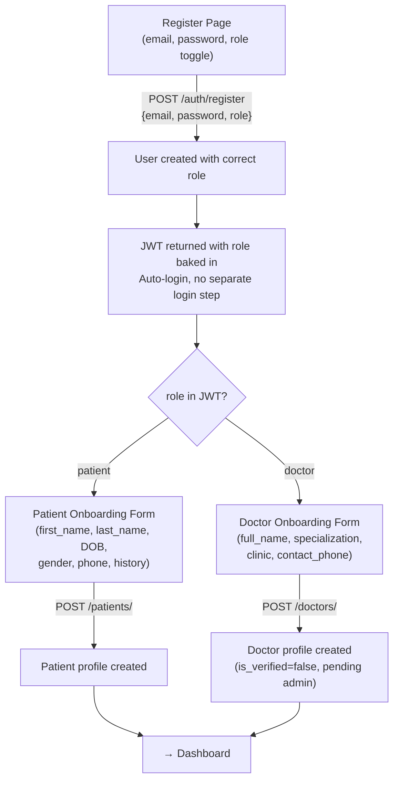

# Registration Flow Redesign — Clean Architecture

## Problem Summary

| Layer | What it expects/collects |
|---|---|
| **Frontend `RegisterPage.jsx`** | `name`, `email`, `phone`, `password`, `confirmPassword` |
| **Backend `POST /auth/register`** | `email`, `password`, `role` |
| **Backend `POST /patients/`** | `first_name`, `last_name`, `date_of_birth`, `gender`, `phone_number`, `medical_history` |
| **Backend `POST /doctors/`** | `full_name`, `specialization`, `clinic_location`, `contact_phone`, ... |

**Issues:**
1. Frontend collects `name` and `phone` — silently dropped, they belong to profile tables
2. Frontend never asks for `role` — everyone defaults to `guest`
3. Backend register doesn't return a JWT — forces a separate login step
4. No profile onboarding step exists in the frontend

## Proposed Architecture — Single-Phase Registration + Profile Onboarding



### Why this is better than a two-phase approach

| Concern | Two-phase (old plan) | Single-phase (this plan) |
|---|---|---|
| JWT rotation | Needed after role change | Never — role is in the first JWT |
| Extra endpoints | `PUT /auth/role` (new) | None — uses existing endpoints |
| "Limbo" state | Guest JWT that isn't a real guest | No ambiguity — role is set from registration |
| `guest` role meaning | Overloaded (anonymous + unfinished) | Clean — only means anonymous visitor |
| API calls to register | 2 (register + set role) | 1 (register) |
| Complexity | Higher | Lower |

### The `guest` role stays clean

- `guest` = anonymous visitor who clicked "Continue as Guest" (`POST /auth/anonymous-guest`)
- `patient` = registered user who chose patient at registration
- `doctor` = registered user who chose doctor at registration
- `admin` = manually assigned

---

## Proposed Changes

### Backend Changes

---

#### [MODIFY] [auth.py](file:///Users/ameezo/Downloads/GDE/backend/app/api/v1/endpoints/auth.py)

**Change 1: Return JWT on registration** (auto-login after register)

Currently `/register` returns `{ msg, user_id }` and forces a separate login. Change it to return a JWT + user object, identical to the login response format:

```diff
-    return jsonify({"msg": "User created successfully", "user_id": user.id}), 201
+    access_token = create_access_token(
+        subject=user.id, role=user.role.value, is_verified=user.is_verified
+    )
+    return jsonify({
+        "msg": "User created successfully",
+        "access_token": access_token,
+        "token_type": "bearer",
+        "user": {
+            "id": user.id,
+            "email": user.email,
+            "role": user.role.value,
+            "is_verified": user.is_verified,
+        }
+    }), 201
```

**Change 2: Add `GET /me` endpoint**

The frontend needs a way to check: "Does this user have a profile yet?" This determines whether to redirect to onboarding or dashboard.

```python
@auth_bp.route("/me", methods=["GET"])
@require_role(["guest", "patient", "doctor", "admin"])
def get_me():
    user_id = int(g.current_user["sub"])
    user = User.query.get(user_id)
    if not user:
        return jsonify({"msg": "User not found"}), 404

    has_profile = False
    if user.role == UserRole.PATIENT:
        has_profile = user.patient_profile is not None
    elif user.role == UserRole.DOCTOR:
        has_profile = user.doctor_profile is not None

    return jsonify({
        "id": user.id,
        "email": user.email,
        "role": user.role.value,
        "is_verified": user.is_verified,
        "has_profile": has_profile,
    }), 200
```

**Change 3: Restrict role values at registration**

Currently any valid `UserRole` string is accepted (including `admin` and `guest`). Add validation so only `patient` and `doctor` can self-register:

```diff
     try:
         role = UserRole(role_str)
     except ValueError:
         return jsonify({"msg": "Invalid role"}), 400
+
+    if role not in (UserRole.PATIENT, UserRole.DOCTOR):
+        return jsonify({"msg": "Can only register as patient or doctor"}), 400
```

> [!IMPORTANT]
> This prevents anyone from self-registering as `admin` or `guest` through the API. Admins should be created manually or by another admin.

---

#### [MODIFY] [auth.py schema](file:///Users/ameezo/Downloads/GDE/backend/app/schemas/auth.py)

Update `UserCreate` to make role required (not optional) and validate against allowed values:

```python
from pydantic import BaseModel, EmailStr, field_validator
from typing import Optional

class UserLogin(BaseModel):
    email: EmailStr
    password: str

class UserCreate(BaseModel):
    email: EmailStr
    password: str
    role: str  # "patient" or "doctor"

    @field_validator("role")
    @classmethod
    def validate_role(cls, v):
        if v not in ("patient", "doctor"):
            raise ValueError("Role must be 'patient' or 'doctor'")
        return v

class TokenResponse(BaseModel):
    access_token: str
    token_type: str = "bearer"
```

---

### Frontend Changes

---

#### [MODIFY] [RegisterPage.jsx](file:///Users/ameezo/Downloads/GDE/frontend/src/pages/RegisterPage.jsx)

**Remove**: `name` and `phone` fields (they belong to profile onboarding)

**Add**: Role toggle (patient / doctor) — two visually distinct clickable cards or a toggle switch

**Keep**: email, password, confirmPassword

**After success**: Redirect to `/onboarding/profile` instead of `/app/dashboard`

Form state becomes:
```js
const [form, setForm] = useState({
  email: '',
  password: '',
  confirmPassword: '',
  role: 'patient',  // default, togglable
});
```

---

#### [NEW] [ProfileOnboardingPage.jsx](file:///Users/ameezo/Downloads/GDE/frontend/src/pages/onboarding/ProfileOnboardingPage.jsx)

Reads the user's role from auth state, renders the appropriate form:

**If role === 'patient'**, shows:

| Field | Input Type | Required |
|---|---|---|
| First Name | text | ✅ |
| Last Name | text | ✅ |
| Date of Birth | date | ❌ |
| Gender | select (Male/Female/Other) | ❌ |
| Phone Number | tel | ❌ |
| Medical History | textarea | ❌ |

Submits to `POST /api/v1/patients/`

**If role === 'doctor'**, shows:

| Field | Input Type | Required |
|---|---|---|
| Full Name | text | ✅ |
| Specialization | text | ✅ |
| Clinic Location | text | ❌ |
| Contact Phone | tel | ❌ |

Submits to `POST /api/v1/doctors/`

After success → redirect to `/app/dashboard`

---

#### [NEW] [OnboardingLayout.jsx](file:///Users/ameezo/Downloads/GDE/frontend/src/layouts/OnboardingLayout.jsx)

Minimal layout for onboarding — centered card with Cura branding, step indicator showing "Step 1: Account ✓ → Step 2: Profile". Reuses existing design tokens.

---

#### [NEW] [OnboardingPages.css](file:///Users/ameezo/Downloads/GDE/frontend/src/pages/OnboardingPages.css)

Styling for the role toggle on RegisterPage and the profile onboarding form.

---

#### [MODIFY] [router.jsx](file:///Users/ameezo/Downloads/GDE/frontend/src/app/router.jsx)

Add onboarding route:

```jsx
import OnboardingLayout from '../layouts/OnboardingLayout';
import ProfileOnboardingPage from '../pages/onboarding/ProfileOnboardingPage';

// Add to routes array:
{
  element: <ProtectedRoute><OnboardingLayout /></ProtectedRoute>,
  children: [
    { path: '/onboarding/profile', element: <ProfileOnboardingPage /> },
  ],
},
```

---

#### [MODIFY] [routePaths.js](file:///Users/ameezo/Downloads/GDE/frontend/src/utils/routePaths.js)

```diff
+  ONBOARDING_PROFILE: '/onboarding/profile',
```

---

#### [MODIFY] [useAuth.jsx](file:///Users/ameezo/Downloads/GDE/frontend/src/hooks/useAuth.jsx)

Replace all mock logic with real API calls:

- `register({ email, password, role })` → `POST /api/v1/auth/register` → stores JWT + user
- `login(email, password)` → `POST /api/v1/auth/login` → stores JWT + user
- `logout()` → clears stored JWT + user
- New: `fetchMe()` → `GET /api/v1/auth/me` → returns `has_profile` status
- New: `hasProfile` boolean in auth state — used by guards/redirects

---

#### [NEW] [client.js](file:///Users/ameezo/Downloads/GDE/frontend/src/api/client.js)

Shared API client (as defined in the master guide).

#### [NEW] [authApi.js](file:///Users/ameezo/Downloads/GDE/frontend/src/api/authApi.js)

```js
import { apiRequest } from "./client";

export const register = (payload) =>
  apiRequest("/auth/register", { method: "POST", body: JSON.stringify(payload) });

export const login = (payload) =>
  apiRequest("/auth/login", { method: "POST", body: JSON.stringify(payload) });

export const getMe = () =>
  apiRequest("/auth/me", { method: "GET" });

export const loginAsGuest = () =>
  apiRequest("/auth/anonymous-guest", { method: "POST" });
```

#### [NEW] [patientsApi.js](file:///Users/ameezo/Downloads/GDE/frontend/src/api/patientsApi.js)

```js
import { apiRequest } from "./client";

export const createPatientProfile = (payload) =>
  apiRequest("/patients/", { method: "POST", body: JSON.stringify(payload) });
```

#### [NEW] [doctorsApi.js](file:///Users/ameezo/Downloads/GDE/frontend/src/api/doctorsApi.js)

```js
import { apiRequest } from "./client";

export const createDoctorProfile = (payload) =>
  apiRequest("/doctors/", { method: "POST", body: JSON.stringify(payload) });
```

---

## Summary of All File Changes

| Action | File | What changes |
|---|---|---|
| MODIFY | `backend/app/api/v1/endpoints/auth.py` | Return JWT on register, add `GET /me`, restrict self-register roles |
| MODIFY | `backend/app/schemas/auth.py` | Make role required, validate patient/doctor only |
| MODIFY | `frontend/src/pages/RegisterPage.jsx` | Remove name/phone, add role toggle, redirect to onboarding |
| MODIFY | `frontend/src/hooks/useAuth.jsx` | Replace mocks with real API calls, add `hasProfile` |
| MODIFY | `frontend/src/app/router.jsx` | Add onboarding route |
| MODIFY | `frontend/src/utils/routePaths.js` | Add `ONBOARDING_PROFILE` constant |
| NEW | `frontend/src/api/client.js` | Shared API client |
| NEW | `frontend/src/api/authApi.js` | Auth API functions |
| NEW | `frontend/src/api/patientsApi.js` | Patient profile creation |
| NEW | `frontend/src/api/doctorsApi.js` | Doctor profile creation |
| NEW | `frontend/src/pages/onboarding/ProfileOnboardingPage.jsx` | Profile form (patient or doctor) |
| NEW | `frontend/src/layouts/OnboardingLayout.jsx` | Onboarding layout with step indicator |
| NEW | `frontend/src/pages/OnboardingPages.css` | Onboarding styling |

## Verification Plan

### Automated Tests
1. **Backend flow via `curl`**:
   - `POST /auth/register { email, password, role: "patient" }` → returns JWT with `role=patient`
   - `GET /auth/me` with JWT → `has_profile: false`
   - `POST /patients/` with profile data → patient created
   - `GET /auth/me` → `has_profile: true`
   - Attempt `POST /auth/register { role: "admin" }` → rejected with 400

2. **Frontend browser test**:
   - Register as patient → see profile onboarding → fill form → lands on dashboard
   - Register as doctor → see doctor-specific form → fill form → lands on dashboard (pending verification)
   - Login with existing user who has profile → goes straight to dashboard
   - Login with existing user who has NO profile → redirected to onboarding
